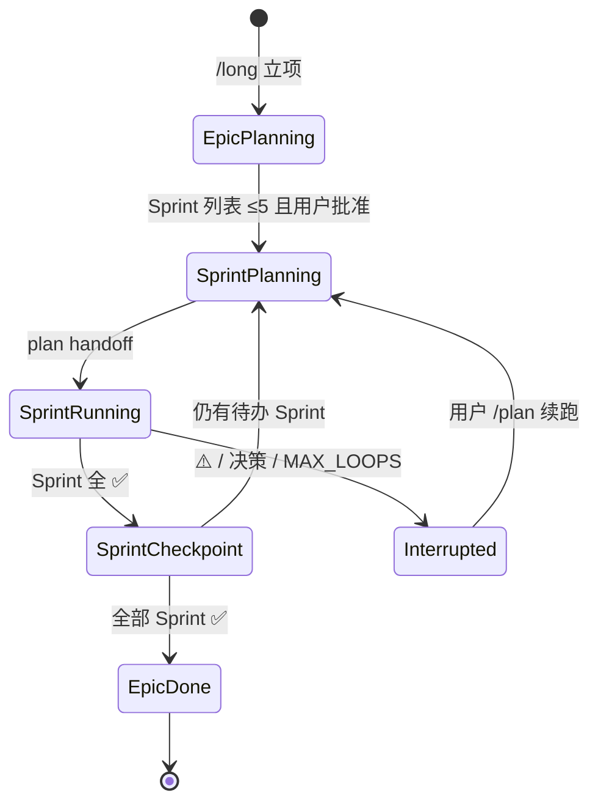

# long · 层级与收敛（详）

Epic 级长程任务的**固定三层**；禁止第四层任务 ID。与 **plan**「先总后分」对齐，但 **long** 管跨 Sprint 的 Epic 外壳。

## 三层金字塔

| 层 | ID 形态 | 载体 | 作用 | 同级上限 |
|----|---------|------|------|----------|
| **L0 Epic** | `EPIC-*` 或自然语言标题 | `.cursorGrowth/long-state.json` + 候选表（可选） | 总 Goal · 总 Done when · Sprint 列表 | **≤5** Sprint |
| **L1 Sprint** | `SPRINT-*` | `.cursorGrowth/plan.md` Active 区块 | 单迭代 Goal · TASK 表 · 执行顺序 | **≤5** TASK |

Sprint Goal 须为**能力交付**；打 tag/merge 等出口 → **`/release`**（`plan/reference/sprint-goal-gate.md`）。
| **L2 Task** | `TASK-*` | plan TASK 表 | 可验收增量 · 一次 commit | **≤5**（规模门禁） |

**禁止**：

- Task 内再拆子 TASK（实现步骤留在 Task 内部，见 **run** §执行期递归边界）
- Epic 下直接挂 TASK（必须先经 Sprint）
- 运行时发现新 Theme → 写入**下一 Sprint 候选**，不插入当前 Sprint 表

## MECE 与完备性

同层节点须 **互斥且完备**（MECE）：

| 层 | 互斥 | 完备 |
|----|------|------|
| Sprint 列表 | 每个 Sprint 有独立 Goal，不重叠 Target | 覆盖 Epic Done when 的全部 P0 范围 |
| TASK 表 | 每条有单一验收命令 | Sprint Done when 可被执行顺序走完证明 |

拆不出 ≤5 个 Sprint → **升高抽象**（合并主题）或拆成多个 Epic，勿加深层级。

## 与 plan / run 分工

| 时机 | long | plan | run |
|------|------|------|-----|
| Epic 拆 Sprint 列表 | ✅ | | |
| 单 Sprint Goal/TASK/ handoff | 触发 | ✅ | |
| TASK 实现 + verify + commit | | | ✅ |
| Sprint 闭合归档 | 更新 long-state · 决定是否下一 Sprint | archive 笔记 | verify + archive 执行 |
| `AUTONOMOUS:true` 单 Sprint 连跑 | 不替代 | handoff | ✅ 同会话 |

**long 不绕过** `gate-check` · `task-verify` · `PLAN_APPROVED`。

## 状态机（Epic 级）

## 决策与 scope 冻结

| 事件 | 动作 |
|------|------|
| `/run` 中发现新独立 Theme | 记入 plan「下一 Sprint 候选」或 long-state，**不**扩当前 TASK 树 |
| 架构/契约冲突 | `⚠️` · `autonomy.interrupt_on` → 停 Epic 链，回 **plan** |
| 用户改 Epic Goal | 新 Epic 或 `/plan` 重排；勿静默合并 |

## 引用

- 节奏与 checkpoint → `pacing-checkpoint.md`
- 单 Sprint 自治链 → **plan** `reference/autonomy-chain.md`
- 规模门禁 → **plan** skill §plan≥5 · `workflow.mdc`
