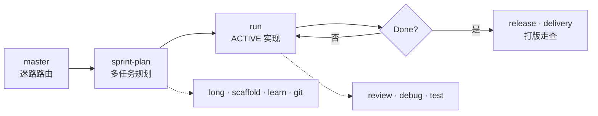

# dsh-super

> **Plan once · Run with gates · Ship with receipts.**

**中文**：把 [Super Cursor](../cursor-ai) 的 Agent 工作流 SOP 搬进 [DeepSeek Harness](https://github.com/deepseek-ai/deepseek-harness) — **16** 个 workflow skill、一套 profile bundle、项目级 `.dsh/growth/` 模板。不是 DSH fork，也不是 Cursor 插件。

[](package.json)
[](package.json)
[](https://github.com/topics/dsh-plugin)
[](https://github.com/deepseek-ai/deepseek-harness)

---

## Why dsh-super

Cursor 里用 `/plan` · `/run` · `/release` 跑 Sprint 的人，换到 DSH 后往往缺同一套**可审计、可验证**的流程约束。

dsh-super 填这个缝：

| 你得到 | 不是什么 |
|---|---|
| 16 个 bundled **skills**（Cordis 插件挂载） | 不是 fork `deepseek-harness` |
| **`@dsh-super/bundle-super`** — `dsh plugin add` 一键进 profile | 不是 Cursor rules 复制粘贴 |
| **`.dsh/growth/`** — plan · learn · archive 项目本地镜像 | 不是替代 DSH 内置 `/plan` plan mode |

日常口诀：**一次 sprint-plan 批准 · 一次 run 连跑 · 决策才停 · verify 才勾 ✅**

中文逐步指南 → [docs/quickstart.zh.md](docs/quickstart.zh.md)

---

## The loop



| 阶段 | Skills | 一句话 |
|---|---|---|
| **路由** | `master` | 不知道下一步加载谁 |
| **规划** | `sprint-plan` · `long` | 多任务 Sprint / Epic（≠ DSH `/plan` 单任务设计） |
| **执行** | `run` · `debug` · `test` | 按 `.dsh/growth/plan.md` ACTIVE 行实现 + verify |
| **沉淀** | `learn` · `git` · `scaffold` | 项目约定 · 分支提交 · 空仓脚手架 |
| **交付** | `review` · `delivery` · `release` | PR 回顾 · 7 维走查 · merge / tag / CHANGELOG |

---

## What's inside

```
packages/
  skill-provider/     # @dsh-super/skill-provider — Cordis plugin + skills/
  bundle-super/       # @dsh-super/bundle-super — dsh.bundle.patch
presets/super/        # 可选 agent preset（v0.1 配合 standard 使用）
templates/growth/     # plan.md · learn/ · archive/ 种子
scripts/              # install-super-dsh.sh · dsh-guard.sh · verify-super-dsh.sh
docs/                 # mapping · naming · quickstart · workflow-guard
```

| Piece | Package / path | Role |
|---|---|---|
| Bundled skills | `@dsh-super/skill-provider` | 16 workflow skills（见上表） |
| Profile bundle | `@dsh-super/bundle-super` | `cordis.patch.yml` 自动挂载 skill provider |
| Agent preset | `presets/super/` | 可选 `super` preset |
| Growth templates | `templates/growth/` | 项目本地 `.dsh/growth/` 种子 |
| Installer | `scripts/install-super-dsh.sh` | 复制 growth 模板 + 打印 profile 说明 |
| Workflow guard | `scripts/dsh-guard.sh` | `gate-check` · `plan-check` · `task-verify` · `next-task` |

Bundle 声明（与 [turtle-ui](https://github.com/turtle1999/turtle-ui) 等同模式）：

```json
"dsh": { "bundle": { "patch": "./cordis.patch.yml" } }
```

---

## Quick start

### 1 · Build（本仓开发）

```sh
git clone <this-repo> dsh-super && cd dsh-super
pnpm install
pnpm run build
pnpm run verify          # 16 skills + DSH 适配 token 结构检查
```

开发时 `skill-provider` 的 peer 可指向同级 `deepseek-harness` checkout。

### 2 · Install bundle（DSH profile）

```sh
export DSH_SUPER_HOME=/path/to/dsh-super   # 或省略，直接用 clone 路径

dsh plugin --profile web add "file:$DSH_SUPER_HOME/packages/bundle-super"
```

验证：

```sh
dsh --profile web --dump-config | grep super-skills
ls "$DSH_HOME/profiles/web/node_modules/@dsh-super/skill-provider/skills/"
```

**不要**在 profile 的 `cordis.patch.yml` 里再手动 insert 同一插件 — bundle 已挂载，双挂载会 boot 失败。

从 git 安装时若 pnpm ≥10 拦截 `prepare` build，按 CLI 提示把 key 写入 profile 的 `pnpm-workspace.yaml` → `allowBuilds`，再重跑 `dsh plugin add`。详见 [Harness publish 文档](https://deepseek-harness.github.io/deepseek-harness/en/develop/basic/publish)。

### 3 · Seed project growth

在目标 Git 仓库根：

```sh
export DSH_SUPER_HOME=/path/to/dsh-super
"$DSH_SUPER_HOME/scripts/install-super-dsh.sh" --here --copy-plan
```

创建 `.dsh/growth/`（plan · learn · archive），通常 gitignore。

### 3b · Workflow guard（Sprint 闸门）

`sprint-plan` 批准 Sprint 后，**`run`** 前：

```sh
pnpm run gate-check    # PLAN_APPROVED + ACTIVE
pnpm run plan-check    # handoff 结构
pnpm run task-verify   # 当前 ACTIVE 验收
pnpm run next-task     # 下一待办 TASK id
```

plan 路径：`.dsh/growth/plan.md`（开发本仓时自动读 `.cursorGrowth/plan.md`）。详见 [docs/workflow-guard.md](docs/workflow-guard.md)。

### 4 · Use in a session

用 **standard** preset（或 `install-super-dsh.sh --preset` 后的 **super**），按场景加载 skill：

| Skill | 何时加载 |
|---|---|
| `master` | 迷路 / 新会话 |
| `sprint-plan` | 多任务 Sprint 规划 |
| `run` | 执行 plan.md ACTIVE 行 |
| `review` | PR / 代码结构化回顾 |
| `learn` | 沉淀项目约定 → `.dsh/growth/learn/` |
| `git` | 分支 · 提交 · 合并 |
| `scaffold` | 空仓库脚手架 |
| `long` | 跨 Sprint Epic |
| `release` | merge · PR · tag · CHANGELOG |
| `delivery` | 上线前 7 维走查 |
| `debug` | 复现优先调试循环 |
| `test` | TDD · 分层测试 |
| `security` | 合并前安全审查 |
| `api` | REST/OpenAPI 设计审查 |
| `refactor` | 安全重构 · 死代码删除 |
| `perf` | 性能排查（测量优先） |

单任务方案设计 → DSH 内置 **`/plan`** plan mode（不是 `sprint-plan`）。

Bundle 变更后需**重启** profile（`dsh web`），不像 profile 级 patch 那样热加载。

---

## Naming vs Super Cursor

| Super Cursor | dsh-super | Notes |
|---|---|---|
| `plan` skill | **`sprint-plan`** | 避免与 DSH `/plan` plan mode 冲突 |
| `.cursorGrowth/` | **`.dsh/growth/`** | 项目本地，通常 gitignore |
| `AskQuestion` | **`ask_user_question`** | DSH 交互工具 |
| `rules/*.mdc` | **`docs/discipline.md`** | 常驻纪律摘要 |

完整对照 → [docs/mapping-from-super-cursor.md](docs/mapping-from-super-cursor.md) · [docs/naming.md](docs/naming.md)

---

## Checks

```sh
pnpm run build
pnpm run verify
pnpm run gate-check    # 有 plan 时
pnpm run typecheck
```

`verify-super-dsh.sh` 校验 **16** 个 skill 目录、long/delivery reference、guard 脚本与 npm scripts，以及 Super Cursor 残留 token（`.cursorGrowth` · `AskQuestion` · `runner.sh`）不得出现在 bundled skills 中。

---

## Roadmap

| Version | Scope | Status |
|---|---|---|
| **v0.1** | MVP：`master` · `sprint-plan` · `run` · `review` + bundle + installer | ✅ |
| **v0.2 batch-1** | `learn` · `git` · `scaffold` · `long` | ✅ |
| **v0.2 batch-2** | `release` · `delivery` · `debug` · `test` | ✅ |
| **v0.2 batch-3** | `security` · `api` · `refactor` · `perf` | ✅ current |
| **v0.2 guard** | `dsh-guard.sh` · `pnpm run gate-check` | ✅ |
| **v0.3** | `@dsh-super/workflow` — optional hooks injection | planned |

变更记录 → [CHANGELOG.md](CHANGELOG.md)

---

## Docs

| Doc | Content |
|---|---|
| [quickstart.md](docs/quickstart.md) / [quickstart.zh.md](docs/quickstart.zh.md) | 安装与 dogfood |
| [mapping-from-super-cursor.md](docs/mapping-from-super-cursor.md) | Super Cursor → dsh-super 映射 |
| [naming.md](docs/naming.md) | 命名与包坐标 |
| [workflow-guard.md](docs/workflow-guard.md) | Sprint 闸门（dsh-guard） |

---

## License

MIT（见 `package.json` → `license`）。
