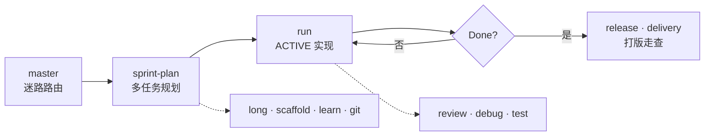

# PlanRun

> **Plan once · Run with gates · Ship with receipts.**

**中文**：把 [Super Cursor](../cursor-ai) 的 Agent 工作流 SOP 搬进 [DeepSeek Harness](https://github.com/deepseek-ai/deepseek-harness) — **28** workflow skills、**12** personas、一套 profile bundle、项目级 `.dsh/growth/` 模板。不是 DSH fork，也不是 Cursor 插件。

[](package.json)
[](https://znza.top/planrun/)
[](package.json)
[](https://github.com/topics/dsh-plugin)
[](https://github.com/deepseek-ai/deepseek-harness)

---

## Why PlanRun

Cursor 里用 `/plan` · `/run` · `/release` 跑 Sprint 的人，换到 DSH 后往往缺同一套**可审计、可验证**的流程约束。

PlanRun 填这个缝：

| 你得到 | 不是什么 |
|---|---|
| 28 bundled **skills** + **12 personas**（Cordis plugin mount） | 不是 fork `deepseek-harness` |
| **`@planrun/bundle`** — `dsh plugin add @planrun/bundle` 一键进 profile | 不是 Cursor rules 复制粘贴 |
| **`.dsh/growth/`** — plan · learn · archive 项目本地镜像 | 不是替代 DSH 内置 `/plan` plan mode |

日常口诀：**一次 sprint-plan 批准 · 一次 run 连跑 · 决策才停 · verify 才勾 ✅**

**Install (any user)** → [docs/en/install.md](docs/en/install.md) · Quick start → [docs/en/quickstart.md](docs/en/quickstart.md) · 中文 → [docs/zh/quickstart.md](docs/zh/quickstart.md) · **站点** → [znza.top/planrun](https://znza.top/planrun/)

---

## Who should use PlanRun

| Fit | Reason |
|-----|--------|
| ✅ You use **DeepSeek Harness** and want plan → run → verify → release discipline | PlanRun mounts as `@planrun/bundle` |
| ✅ You want **28 bundled skills** + **12 personas** without copying `.cursor/` by hand | Cordis plugin + growth templates |
| ⚠️ **Cursor only**, no DSH | Use **Super Cursor** `.cursor/` install on your repo — see [install.md](docs/en/install.md) Path C |
| ❌ You need a standalone desktop app or zero Node | Out of scope — host is DSH + Node toolchain |

**License**: MIT — anyone may install, modify, and redistribute. **No** maintainer account or machine-specific paths required.

### Prerequisites (summary)

| Item | Required for |
|------|----------------|
| [DeepSeek Harness](https://github.com/deepseek-ai/deepseek-harness) + `dsh` | npm / file bundle install |
| Node `^22.19` or `>=24` | build · verify · guard scripts |
| bash | `install-planrun.sh` · `dsh-guard.sh` |

Full table and three install paths → **[docs/en/install.md](docs/en/install.md)**.

### PlanRun (DSH) vs Super Cursor (`.cursor/`)

| | **PlanRun** (`@planrun/bundle`) | **Super Cursor** (mother `.cursor/`) |
|--|--------------------------------|--------------------------------------|
| **Host** | DeepSeek Harness profile | Cursor IDE project |
| **Plan file** | `.dsh/growth/plan.md` | `.cursorGrowth/plan.md` |
| **Install** | `dsh plugin add @planrun/bundle` | `install-super-cursor.sh` → target `.cursor/` |
| **This repo** | `packages/*` published to npm | `.cursor/` skills/rules (dev mother pack) |

---

## The loop


```mermaid
flowchart LR
  A[master<br/>迷路路由] --> B[sprint-plan<br/>多任务规划]
  B --> C[run<br/>ACTIVE 实现]
  C --> D{Done?}
  D -->|否| C
  D -->|是| E[release · delivery<br/>打版走查]
  C -.-> F[review · debug · test]
  B -.-> G[long · scaffold · learn · git]
```

| 阶段 | Skills | 一句话 |
|---|---|---|
| **路由** | `master` | 不知道下一步加载谁 |
| **规划** | `sprint-plan` · `long` | 多任务 Sprint / Epic（≠ DSH `/plan` 单任务设计） |
| **执行** | `run` · `debug` · `test` | 按 `.dsh/growth/plan.md` ACTIVE 行实现 + verify |
| **沉淀** | `learn` · `git` · `scaffold` | 项目约定 · 分支提交 · 空仓脚手架 |
| **交付** | `review` · `delivery` · `release` | PR 回顾 · 7 维走查 · merge / tag / CHANGELOG |

---

## What's inside

```
packages/
  skill-provider/       # @planrun/skill-provider — Cordis plugin + skills/
  bundle-planrun/       # @planrun/bundle — dsh.bundle.patch + agent presets
  workflow/             # @planrun/workflow — session hooks (growth · run-start · run-stop)
presets/                # preset 源：<id>/{preset.yml,plugins.yml}
templates/growth/       # plan.md · learn/ · archive/ 种子
scripts/                # install-planrun.sh · gen-presets.mjs · dsh-guard.sh · verify-*
docs/                   # en/ · zh/ VitePress site + mapping · quickstart · workflow-guard
```

| Piece | Package / path | Role |
|---|---|---|
| Bundled skills | `@planrun/skill-provider` | 28 workflow skills + `config/roles.json` (12 personas) |
| Profile bundle | `@planrun/bundle` | `cordis.patch.yml` 挂载 skill provider + **workflow**；`presets.patch.yml` 声明 4 个 agent preset |
| Agent presets | `presets/` → `presets.patch.yml` | 官方 `@deepseek-ai/dsh-agent-preset` 声明（由 `scripts/gen-presets.mjs` 生成） |
| Growth templates | `templates/growth/` | 项目本地 `.dsh/growth/` 种子 |
| Installer | `scripts/install-planrun.sh` | 复制 growth 模板 + 打印 profile 说明 |
| Workflow guard | `scripts/dsh-guard.sh` | `gate-check` · `plan-check` · `task-verify` · `next-task` |

Bundle 声明（`patch` 是**有序列表**，与官方 `dsh-web-app` 同模式）：

```json
"dsh": {
  "bundle": { "patch": ["./cordis.patch.yml", "./presets.patch.yml"] }
}
```

---

## Quick start

### 1 · Build（本仓开发）

```sh
git clone https://github.com/wangqiqi/planrun.git planrun && cd planrun
pnpm install
pnpm run build
pnpm run verify          # 28 skills + 12 personas + DSH adapter token checks
```

开发时 `skill-provider` 的 peer 可指向同级 `deepseek-harness` checkout。

### 2 · Install bundle（DSH profile）

**已发布（推荐）**：

```sh
dsh plugin --profile web add @planrun/bundle
```

**本仓开发**（`pack-local.sh` 会先构建，再把 `workspace:^` 改写成 file: 依赖）：

```sh
export PLANRUN_HOME=/path/to/planrun
"$PLANRUN_HOME/scripts/pack-local.sh"
dsh plugin --profile web add "file:$PLANRUN_HOME/dist-local/bundle-planrun"
```

**不要**直接 `add "file:$PLANRUN_HOME/packages/bundle-planrun"`：monorepo 的 `workspace:^` 依赖会报 `ERR_PNPM_WORKSPACE_PKG_NOT_FOUND`。

验证：

```sh
dsh --profile web --dump-config | grep planrun-skills
ls "$DSH_HOME/profiles/web/node_modules/@planrun/skill-provider/skills/"
```

**不要**在 profile 的 `cordis.patch.yml` 里再手动 insert 同一插件 — bundle 已挂载，双挂载会 boot 失败。

详见 [publish.md](docs/en/publish.md) · [Harness publish 文档](https://deepseek-harness.github.io/deepseek-harness/en/develop/basic/publish)。

### 3 · Seed project growth

在目标 Git 仓库根：

```sh
export PLANRUN_HOME=/path/to/planrun
"$PLANRUN_HOME/scripts/install-planrun.sh" --here --copy-plan
```

创建 `.dsh/growth/`（plan · learn · archive），通常 gitignore。

### 3b · Workflow guard（Sprint 闸门）

`sprint-plan` 批准 Sprint 后，**`run`** 前：

```sh
pnpm run gate-check    # PLAN_APPROVED + ACTIVE
pnpm run plan-check    # handoff 结构
pnpm run task-verify   # 当前 ACTIVE 验收
pnpm run next-task     # 下一待办 TASK id
```

plan 路径：`.dsh/growth/plan.md`（开发本仓时自动读 `.cursorGrowth/plan.md`）。详见 [docs/en/workflow-guard.md](docs/en/workflow-guard.md)。

### 4 · Use in a session

用 **standard** preset（或 bundle 自带的 **planrun** / **planrun-review** / **planrun-spike** / **planrun-ship**），按场景加载 skill。
四个 preset 由 `@planrun/bundle` 的 `presets.patch.yml` 声明，装完 bundle 重启 `dsh web` 即在 preset 选择器可见（无需再手动复制目录）：

| Skill | 何时加载 |
|---|---|
| `master` | 迷路 / 新会话 |
| `sprint-plan` | 多任务 Sprint 规划 |
| `run` | 执行 plan.md ACTIVE 行 |
| `review` | PR / 代码结构化回顾 |
| `learn` | 沉淀项目约定 → `.dsh/growth/learn/` |
| `git` | 分支 · 提交 · 合并 |
| `scaffold` | 空仓库脚手架 |
| `long` | 跨 Sprint Epic |
| `release` | merge · PR · tag · CHANGELOG |
| `delivery` | 上线前 7 维走查 |
| `debug` | 复现优先调试循环 |
| `test` | TDD · 分层测试 |
| `security` | 合并前安全审查 |
| `api` | REST/OpenAPI 设计审查 |
| `refactor` | 安全重构 · 死代码删除 |
| `perf` | 性能排查（测量优先） |
| `mcp` | MCP 服务器设计与 Eval |
| `study` | 学新技术/语言（≠ `learn` 本仓约定） |
| `user-manual` | 可发布使用说明书 · 配图 regen |
| `test-report` | 可发布测试报告 · verify 汇总 |

单任务方案设计 → DSH 内置 **`/plan`** plan mode（不是 `sprint-plan`）。

Bundle 变更后需**重启** profile（`dsh web`），不像 profile 级 patch 那样热加载。

---

## Naming vs Super Cursor

| Super Cursor | PlanRun | Notes |
|---|---|---|
| `plan` skill | **`sprint-plan`** | 避免与 DSH `/plan` plan mode 冲突 |
| `.cursorGrowth/` | **`.dsh/growth/`** | 项目本地，通常 gitignore |
| `AskQuestion` | **`ask_user_question`** | DSH 交互工具 |
| `rules/*.mdc` | **`docs/en/discipline.md`** | 常驻纪律摘要 |

完整对照 → [docs/en/mapping-from-super-cursor.md](docs/en/mapping-from-super-cursor.md) · [docs/en/naming.md](docs/en/naming.md)

---

## Checks

```sh
pnpm run build
pnpm run verify
pnpm run verify:publish   # npm pack 结构（lib/*.js 运行时模块必须齐全）
pnpm run verify:e2e       # 构建→装临时 profile→boot（须 DEEPSEEK_HARNESS_HOME）
pnpm run verify:dogfood   # 须 DEEPSEEK_HARNESS_HOME
pnpm run gate-check    # 有 plan 时
pnpm run typecheck
```

`verify-planrun.sh` checks **28** skill directories, **12** persona catalog, **4** subagent presets, bundled `agents/*.md`, long/delivery references, guard scripts and npm scripts, and ensures Super Cursor legacy tokens (`.cursorGrowth` · `AskQuestion` · `runner.sh`) do not appear in bundled skills. It also fails on a bundled skill name that collides with an official DSH skill (`dsh-badge` · `office-*` · `cordis-*`) or command (`plan` · `compact` · `goal` · `feedback`), on a stale `presets.patch.yml`, and on retired DSH APIs (`agent/session-start`, `kind: 'plugin'`).

`verify-plugin-e2e.sh` is the only check that proves the plugin *loads*: it packs the
packages, installs them into a throwaway profile, asserts the bundle rows in
`--dump-config`, imports the skill catalog, and boots headless. It fails on
`failed to import`, an incompatible dsh peer range, or a message source kind the
session format rejects.

---

## Roadmap

| Version | Scope | Status |
|---|---|---|
| **v0.1** | MVP：`master` · `sprint-plan` · `run` · `review` + bundle + installer | ✅ |
| **v0.2 batch-1** | `learn` · `git` · `scaffold` · `long` | ✅ |
| **v0.2 batch-2** | `release` · `delivery` · `debug` · `test` | ✅ |
| **v1.0** | PlanRun 品牌更名 · `@planrun/*` · guard MVP · 16 skills | ✅ |
| **v1.1** | `@planrun/workflow` — optional hooks injection | ✅ |
| **v1.2** | Harness 结构 dogfood（`verify:dogfood`） | ✅ |
| **v1.3** | defer skills: `mcp` · `study` · `user-manual` · `test-report` | ✅ |
| **v1.4** | **12 personas** + tool skills · 27 bundled | ✅ |
| **v1.5** | npm publish · `@planrun/bundle` · guard cwd · project guard seed | ✅ |
| **v1.6** | subagent presets · `agents/*.md` · `docs/en/subagents.md` | ✅ |
| **v1.7** | DSH API 对齐（`agent/created` · source kind）· 发布打包修复 · preset 改为官方 bundle 声明 · `verify:e2e` | ✅ current |

变更记录 → [CHANGELOG.md](CHANGELOG.md)

---

## Docs

| Doc | Content |
|---|---|
| **站点** | [znza.top/planrun](https://znza.top/planrun/)（`docs/en/` · `docs/zh/`） |
| [en/quickstart.md](docs/en/quickstart.md) / [zh/quickstart.md](docs/zh/quickstart.md) | 安装与 dogfood |
| [dogfood.md](docs/en/dogfood.md) | Harness 结构 dogfood（`verify:dogfood`） |
| [mapping-from-super-cursor.md](docs/en/mapping-from-super-cursor.md) | Super Cursor → PlanRun 映射 |
| [naming.md](docs/en/naming.md) | 命名与包坐标 |
| [workflow-guard.md](docs/en/workflow-guard.md) | Sprint 闸门（dsh-guard） |
| [workflow-hooks-map.md](docs/en/workflow-hooks-map.md) | Cursor hook → DSH 触点映射 |
| [publish.md](docs/en/publish.md) | npm 发布与用户安装 |
| [subagents.md](docs/en/subagents.md) | ship · review · spike 预设与委派 |

---

## License

MIT（见 `package.json` → `license`）。
