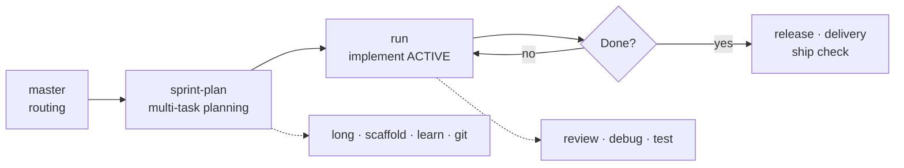

# PlanRun

**English** | [中文](README.zh.md)

> **Plan once · Run with gates · Ship with receipts.**

Port the [Super Cursor](https://github.com/wangqiqi/cursor-ai) agent workflow SOP into [DeepSeek Harness](https://github.com/deepseek-ai/deepseek-harness) — **28** workflow skills, **12** personas, one profile bundle, and project-local `.dsh/growth/` templates. Not a DSH fork, and not a Cursor plugin.

[](package.json)
[](https://znza.top/planrun/en/)
[](package.json)
[](https://github.com/topics/dsh-plugin)
[](https://github.com/deepseek-ai/deepseek-harness)

---

## Why PlanRun

People who ran sprints in Cursor with `/plan` · `/run` · `/release` usually miss the same **auditable, verifiable** process constraints after moving to DSH.

PlanRun fills that gap:

| You get | It is not |
|---|---|
| 28 bundled **skills** + **12 personas** (Cordis plugin mount) | A fork of `deepseek-harness` |
| **`@planrun/bundle`** — `dsh plugin add @planrun/bundle` installs it into a profile | Copy-pasted Cursor rules |
| **`.dsh/growth/`** — a project-local plan · learn · archive mirror | A replacement for DSH's built-in `/plan` plan mode |

The daily rule: **approve one sprint-plan · run it in one go · stop only for decisions · tick ✅ only after verify**

**Install (any user)** → [docs/en/install.md](docs/en/install.md) · Quick start → [docs/en/quickstart.md](docs/en/quickstart.md) · **Site** → [znza.top/planrun/en](https://znza.top/planrun/en/)

---

## Who should use PlanRun

| Fit | Reason |
|-----|--------|
| ✅ You use **DeepSeek Harness** and want plan → run → verify → release discipline | PlanRun mounts as `@planrun/bundle` |
| ✅ You want **28 bundled skills** + **12 personas** without hand-copying `.cursor/` | Cordis plugin + growth templates |
| ⚠️ **Cursor only**, no DSH | Use the **Super Cursor** `.cursor/` install in your repo — see [install.md](docs/en/install.md) Path C |
| ❌ You need a standalone desktop app or zero Node | Out of scope — the host is DSH + a Node toolchain |

**License**: MIT — anyone may install, modify, and redistribute. **No** maintainer account or machine-specific paths required.

### Prerequisites (summary)

| Item | Required for |
|------|----------------|
| [DeepSeek Harness](https://github.com/deepseek-ai/deepseek-harness) + `dsh` | npm / local `file:` bundle install |
| Node `^22.19` or `>=24` | build · verify · guard scripts |
| bash | `install-planrun.sh` · `dsh-guard.sh` |

Full table and three install paths → **[docs/en/install.md](docs/en/install.md)**.

### PlanRun (DSH) vs Super Cursor (`.cursor/`)

| | **PlanRun** (`@planrun/bundle`) | **Super Cursor** (mother `.cursor/`) |
|--|--------------------------------|--------------------------------------|
| **Host** | DeepSeek Harness profile | Cursor IDE project |
| **Plan file** | `.dsh/growth/plan.md` | `.cursorGrowth/plan.md` |
| **Install** | `dsh plugin add @planrun/bundle` | `install-super-cursor.sh` → target `.cursor/` |
| **This repo** | `packages/*` published to npm | `.cursor/` skills/rules (dev mother pack) |

---

## The loop


```mermaid
flowchart LR
  A[master<br/>routing] --> B[sprint-plan<br/>multi-task planning]
  B --> C[run<br/>implement ACTIVE]
  C --> D{Done?}
  D -->|no| C
  D -->|yes| E[release · delivery<br/>ship check]
  C -.-> F[review · debug · test]
  B -.-> G[long · scaffold · learn · git]
```

| Stage | Skills | In one line |
|---|---|---|
| **Routing** | `master` | You do not know which skill to load next |
| **Planning** | `sprint-plan` · `long` | Multi-task sprint / epic (≠ DSH `/plan` single-task design) |
| **Execution** | `run` · `debug` · `test` | Implement the ACTIVE row of `.dsh/growth/plan.md` + verify |
| **Retention** | `learn` · `git` · `scaffold` | Project conventions · branches and commits · empty-repo scaffold |
| **Delivery** | `review` · `delivery` · `release` | PR review · 7-dimension ship check · merge / tag / CHANGELOG |

---

## What's inside

```
cordis.patch.yml        # GitHub-install bundle layer (relative rows → file:// URLs)
packages/
  skill-provider/       # @planrun/skill-provider — Cordis plugin + skills/
  bundle-planrun/       # @planrun/bundle — dsh.bundle.patch + agent presets
  workflow/             # @planrun/workflow — session hooks (growth · run-start · run-stop)
presets/                # preset sources: <id>/{preset.yml,plugins.yml}
templates/growth/       # plan.md · learn/ · archive/ seeds
scripts/                # install-planrun.sh · gen-presets.mjs · dsh-guard.sh · verify-*
docs/                   # en/ · zh/ VitePress site + mapping · quickstart · workflow-guard
```

| Piece | Package / path | Role |
|---|---|---|
| Bundled skills | `@planrun/skill-provider` | 28 workflow skills + `config/roles.json` (12 personas) |
| Profile bundle | `@planrun/bundle` | `cordis.patch.yml` mounts the skill provider + **workflow**; `presets.patch.yml` declares 4 agent presets |
| Agent presets | `presets/` → `presets.patch.yml` | Official `@deepseek-ai/dsh-agent-preset` declarations (generated by `scripts/gen-presets.mjs`) |
| Growth templates | `templates/growth/` | Project-local `.dsh/growth/` seeds |
| Installer | `scripts/install-planrun.sh` | Copies growth templates + prints profile instructions |
| Workflow guard | `scripts/dsh-guard.sh` | `gate-check` · `plan-check` · `task-verify` · `next-task` |

Bundle manifest (`patch` is an **ordered list**, the same shape the official `dsh-web-app` uses):

```json
"dsh": {
  "bundle": { "patch": ["./cordis.patch.yml", "./presets.patch.yml"] }
}
```

---

## Quick start

### 1 · Build (repo development)

```sh
git clone https://github.com/wangqiqi/planrun.git planrun && cd planrun
pnpm install
pnpm run build
pnpm run verify          # 28 skills + 12 personas + DSH adapter token checks
```

While developing, `skill-provider`'s peers can point at a sibling `deepseek-harness` checkout.

### 2 · Install the bundle (DSH profile)

**Published (recommended)**:

```sh
dsh plugin --profile web add @planrun/bundle
```

**From GitHub** (no npm registry, no build permission). The repo root is itself a bundle and its runtime entry points are committed, so pnpm runs no build script at all:

```sh
dsh plugin --profile web add "github:wangqiqi/planrun#v1.8.0"
```

Pin a tag or a commit so a later push cannot change what you install. Install this channel **or** `@planrun/bundle`, never both. `pnpm run verify:lib` fails when the committed runtime drifts from `src/`.

**From this repo** (`pack-local.sh` builds first, then rewrites the `workspace:^` deps to `file:`):

```sh
export PLANRUN_HOME=/path/to/planrun
"$PLANRUN_HOME/scripts/pack-local.sh"
dsh plugin --profile web add "file:$PLANRUN_HOME/dist-local/bundle-planrun"
```

**Do not** `add "file:$PLANRUN_HOME/packages/bundle-planrun"` directly: the monorepo's `workspace:^` deps fail with `ERR_PNPM_WORKSPACE_PKG_NOT_FOUND`.

Verify:

```sh
dsh --profile web --dump-config | grep planrun-skills
ls "$DSH_HOME/profiles/web/node_modules/@planrun/skill-provider/skills/"
```

**Do not** insert the same plugin again in the profile's `cordis.patch.yml` — the bundle already mounts it, and a double mount breaks boot.

See [publish.md](docs/en/publish.md) · [Harness publish docs](https://deepseek-harness.github.io/deepseek-harness/en/develop/basic/publish).

### 3 · Seed project growth

At the target Git repository root:

```sh
export PLANRUN_HOME=/path/to/planrun
"$PLANRUN_HOME/scripts/install-planrun.sh" --here --copy-plan
```

Creates `.dsh/growth/` (plan · learn · archive); usually gitignored.

### 3b · Workflow guard (sprint gate)

After `sprint-plan` approves a sprint, before **`run`**:

```sh
pnpm run gate-check    # PLAN_APPROVED + ACTIVE
pnpm run plan-check    # handoff structure
pnpm run task-verify   # acceptance for the current ACTIVE task
pnpm run next-task     # next pending TASK id
```

Plan path: `.dsh/growth/plan.md` (while developing this repo it falls back to `.cursorGrowth/plan.md`). See [docs/en/workflow-guard.md](docs/en/workflow-guard.md).

### 4 · Use in a session

Use the **standard** preset (or the bundle's own **planrun** / **planrun-review** / **planrun-spike** / **planrun-ship**) and load skills by situation. The four presets are declared by `@planrun/bundle`'s `presets.patch.yml`; restart `dsh web` after installing the bundle and they appear in the preset picker (no manual directory copy):

| Skill | When to load |
|---|---|
| `master` | Lost / new session |
| `sprint-plan` | Multi-task sprint planning |
| `run` | Execute the ACTIVE row of plan.md |
| `review` | PR / structured code review |
| `learn` | Capture project conventions → `.dsh/growth/learn/` |
| `git` | Branch · commit · merge |
| `scaffold` | Empty-repository scaffold |
| `long` | Cross-sprint epic |
| `release` | merge · PR · tag · CHANGELOG |
| `delivery` | 7-dimension pre-release check |
| `debug` | Reproduction-first debugging loop |
| `test` | TDD · layered testing |
| `security` | Pre-merge security review |
| `api` | REST/OpenAPI design review |
| `refactor` | Safe refactor · dead-code removal |
| `perf` | Performance investigation (measure first) |
| `mcp` | MCP server design and eval |
| `study` | Learning a new technology/language (≠ `learn`, which is repo conventions) |
| `user-manual` | Publishable user manual · figure regen |
| `test-report` | Publishable test report · verify summary |

Single-task design → DSH's built-in **`/plan`** plan mode (not `sprint-plan`).

After a bundle change, **restart** the profile (`dsh web`); it does not hot-reload like a profile-level patch.

---

## Naming vs Super Cursor

| Super Cursor | PlanRun | Notes |
|---|---|---|
| `plan` skill | **`sprint-plan`** | Avoids the clash with DSH `/plan` plan mode |
| `.cursorGrowth/` | **`.dsh/growth/`** | Project-local, usually gitignored |
| `AskQuestion` | **`ask_user_question`** | DSH interaction tool |
| `rules/*.mdc` | **`docs/en/discipline.md`** | Standing discipline summary |

Full mapping → [docs/en/mapping-from-super-cursor.md](docs/en/mapping-from-super-cursor.md) · [docs/en/naming.md](docs/en/naming.md)

---

## Checks

```sh
pnpm run build
pnpm run verify
pnpm run verify:publish   # npm pack structure (every lib/*.js runtime module must ship)
pnpm run verify:links     # every repo-relative markdown link resolves
pnpm run verify:e2e       # build → install into a temp profile → boot (needs DEEPSEEK_HARNESS_HOME)
pnpm run verify:lib       # committed packages/*/lib/*.js matches a fresh build
pnpm run verify:github    # the github: channel end to end (needs DEEPSEEK_HARNESS_HOME)
pnpm run verify:dogfood   # needs DEEPSEEK_HARNESS_HOME
pnpm run gate-check    # when a plan exists
pnpm run typecheck
```

`verify-planrun.sh` checks **28** skill directories, the **12** persona catalog, **4** subagent presets, bundled `agents/*.md`, long/delivery references, guard scripts and npm scripts, and ensures Super Cursor legacy tokens (`.cursorGrowth` · `AskQuestion` · `runner.sh`) do not appear in bundled skills. It also fails on a bundled skill name that collides with an official DSH skill (`dsh-badge` · `office-*` · `cordis-*`) or command (`plan` · `compact` · `goal` · `feedback`), on a stale `presets.patch.yml`, and on retired DSH APIs (`agent/session-start`, `kind: 'plugin'`). It also fails when a bundled skill still points at a retired surface (`install-planrun.sh --preset` · `.agent-presets`) or when any repo-relative markdown link is dead, so a docs move cannot leave a dangling path behind.

`verify-plugin-e2e.sh` is the only check that proves the plugin *loads*: it packs the
packages, installs them into a throwaway profile, asserts the bundle rows in
`--dump-config`, imports the skill catalog, and boots headless. It fails on
`failed to import`, an incompatible dsh peer range, or a message source kind the
session format rejects.

`verify-github-install.sh` does the same for the other distribution channel: it installs
`github:wangqiqi/planrun` (or `PLANRUN_GIT_SPEC=git+file:///path#ref` for a local commit) into a
throwaway profile **without granting any build permission**, asserts the committed runtime is
present, that the root patch and preset declarations composed, and boots headless.

---

## Roadmap

| Version | Scope | Status |
|---|---|---|
| **v0.1** | MVP: `master` · `sprint-plan` · `run` · `review` + bundle + installer | ✅ |
| **v0.2 batch-1** | `learn` · `git` · `scaffold` · `long` | ✅ |
| **v0.2 batch-2** | `release` · `delivery` · `debug` · `test` | ✅ |
| **v1.0** | PlanRun rebrand · `@planrun/*` · guard MVP · 16 skills | ✅ |
| **v1.1** | `@planrun/workflow` — optional hooks injection | ✅ |
| **v1.2** | Harness structural dogfood (`verify:dogfood`) | ✅ |
| **v1.3** | Deferred skills: `mcp` · `study` · `user-manual` · `test-report` | ✅ |
| **v1.4** | **12 personas** + tool skills · 27 bundled | ✅ |
| **v1.5** | npm publish · `@planrun/bundle` · guard cwd · project guard seed | ✅ |
| **v1.6** | subagent presets · `agents/*.md` · `docs/en/subagents.md` | ✅ |
| **v1.7** | DSH API alignment (`agent/created` · source kind) · packaging fixes · presets as official bundle declarations · `verify:e2e` | ✅ |
| **v1.8** | GitHub-install channel (`github:wangqiqi/planrun`) · self-contained `prepare` · `verify:links` · `verify:github` | ✅ current |

Changelog → [CHANGELOG.md](CHANGELOG.md)

---

## Docs

| Doc | Content |
|---|---|
| **Site** | [znza.top/planrun/en](https://znza.top/planrun/en/) (`docs/en/` · `docs/zh/`) |
| [quickstart.md](docs/en/quickstart.md) | Install and dogfood |
| [dogfood.md](docs/en/dogfood.md) | Harness structural dogfood (`verify:dogfood`) |
| [mapping-from-super-cursor.md](docs/en/mapping-from-super-cursor.md) | Super Cursor → PlanRun mapping |
| [naming.md](docs/en/naming.md) | Naming and package coordinates |
| [workflow-guard.md](docs/en/workflow-guard.md) | Sprint gate (dsh-guard) |
| [workflow-hooks-map.md](docs/en/workflow-hooks-map.md) | Cursor hook → DSH touchpoint mapping |
| [publish.md](docs/en/publish.md) | npm publishing and user install |
| [subagents.md](docs/en/subagents.md) | ship · review · spike presets and delegation |

---

## License

MIT (see `package.json` → `license`).
