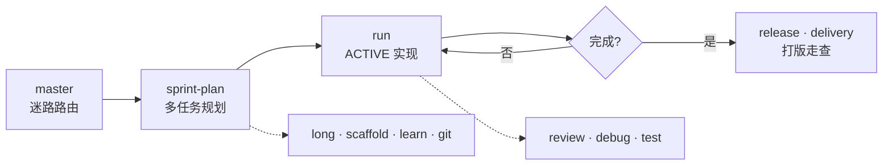

# PlanRun

[English](README.md) | **中文**

> **Plan once · Run with gates · Ship with receipts.**

把 [Super Cursor](../cursor-ai) 的 Agent 工作流 SOP 搬进 [DeepSeek Harness](https://github.com/deepseek-ai/deepseek-harness) — **28** 个 workflow skill、**12** 人格、一套 profile bundle、项目级 `.dsh/growth/` 模板。不是 DSH fork，也不是 Cursor 插件。

[](package.json)
[](package.json)
[](https://github.com/topics/dsh-plugin)
[](https://github.com/deepseek-ai/deepseek-harness)

---

## 为什么用 PlanRun

在 Cursor 里用 `/plan` · `/run` · `/release` 跑 Sprint 的人，换到 DSH 后往往缺同一套**可审计、可验证**的流程约束。

PlanRun 填这个缝：

| 你得到 | 不是什么 |
|---|---|
| 28 个 bundled **skills** + **12 人格**（Cordis 插件挂载） | 不是 fork `deepseek-harness` |
| **`@planrun/bundle`** — `dsh plugin add @planrun/bundle` 一键进 profile | 不是 Cursor rules 复制粘贴 |
| **`.dsh/growth/`** — plan · learn · archive 项目本地镜像 | 不是替代 DSH 内置 `/plan` plan mode |

日常口诀：**一次 sprint-plan 批准 · 一次 run 连跑 · 决策才停 · verify 才勾 ✅**

**安装（任意用户）** → [docs/zh/install.md](docs/zh/install.md) · 快速上手 → [docs/zh/quickstart.md](docs/zh/quickstart.md) · **站点** → [znza.top/planrun/zh/](https://znza.top/planrun/zh/)

---

## 谁适合用 PlanRun

| 情况 | 说明 |
|------|------|
| ✅ 已用 **DeepSeek Harness**，想要 plan → run → verify → release 纪律 | `@planrun/bundle` 挂载即可 |
| ✅ 想要 **28 个 skill** + **12 人格**，不想手抄 `.cursor/` | Cordis 插件 + growth 模板 |
| ⚠️ **只用 Cursor**、没有 DSH | 用 **Super Cursor** 装目标项目 `.cursor/` — 见 [install.md](docs/zh/install.md) 路径 C |
| ❌ 要独立桌面应用或完全不要 Node | 不在范围内 — 宿主是 DSH + Node 工具链 |

**许可**：MIT — 任何人可安装、修改、再分发。**不需要**作者账号或某台开发机路径。

### 前置条件（摘要）

| 项 | 用途 |
|----|------|
| [DeepSeek Harness](https://github.com/deepseek-ai/deepseek-harness) + `dsh` | npm / 本地 file 安装 bundle |
| Node `^22.19` 或 `>=24` | build · verify · guard |
| bash | `install-planrun.sh` · `dsh-guard.sh` |

完整表与三条安装路径 → **[docs/zh/install.md](docs/zh/install.md)**。

### PlanRun（DSH）vs Super Cursor（`.cursor/`）

| | **PlanRun**（`@planrun/bundle`） | **Super Cursor**（母版 `.cursor/`） |
|--|--------------------------------|-------------------------------------|
| **宿主** | DeepSeek Harness profile | Cursor IDE 项目 |
| **plan 文件** | `.dsh/growth/plan.md` | `.cursorGrowth/plan.md` |
| **安装** | `dsh plugin add @planrun/bundle` | `install-super-cursor.sh` → 目标 `.cursor/` |
| **本仓** | `packages/*` 发 npm | `.cursor/` skills/rules（母版开发） |

---

## 工作流闭环



| 阶段 | Skills | 一句话 |
|---|---|---|
| **路由** | `master` | 不知道下一步加载谁 |
| **规划** | `sprint-plan` · `long` | 多任务 Sprint / Epic（≠ DSH `/plan` 单任务设计） |
| **执行** | `run` · `debug` · `test` | 按 `.dsh/growth/plan.md` ACTIVE 行实现 + verify |
| **沉淀** | `learn` · `git` · `scaffold` | 项目约定 · 分支提交 · 空仓脚手架 |
| **交付** | `review` · `delivery` · `release` | PR 回顾 · 7 维走查 · merge / tag / CHANGELOG |

---

## 仓库结构

```
packages/
  skill-provider/     # @planrun/skill-provider — Cordis 插件 + skills/
  bundle-planrun/       # @planrun/bundle — dsh.bundle.patch
  workflow/             # @planrun/workflow — session hooks（growth · run-start · run-stop）
presets/planrun/        # 可选 agent preset（v0.1 配合 standard 使用）
templates/growth/     # plan.md · learn/ · archive/ 种子
scripts/              # install-planrun.sh · dsh-guard.sh · verify-planrun.sh
docs/                 # en/ · zh/ — VitePress 文档站
```

| 组件 | 包 / 路径 | 作用 |
|---|---|---|
| Bundled skills | `@planrun/skill-provider` | 28 workflow skills + `config/roles.json`（12 人格） |
| Profile bundle | `@planrun/bundle` | `cordis.patch.yml` 挂载 skill provider + **workflow** |
| Agent preset | `presets/planrun/` | 可选 `planrun` preset |
| Growth 模板 | `templates/growth/` | 项目本地 `.dsh/growth/` 种子 |
| 安装脚本 | `scripts/install-planrun.sh` | 复制 growth 模板 + 打印 profile 说明 |
| Workflow guard | `scripts/dsh-guard.sh` | `gate-check` · `plan-check` · `task-verify` · `next-task` |

Bundle 声明（与 [turtle-ui](https://github.com/turtle1999/turtle-ui) 等同模式）：

```json
"dsh": { "bundle": { "patch": "./cordis.patch.yml" } }
```

---

## 快速开始

### 1 · 构建（本仓开发）

```sh
git clone https://github.com/wangqiqi/planrun.git planrun && cd planrun
pnpm install
pnpm run build
pnpm run verify          # 28 skills + 12 personas + DSH 适配 token 结构检查
```

开发时 `skill-provider` 的 peer 可指向同级 `deepseek-harness` checkout。

### 2 · 安装 bundle（DSH profile）

**已发布（推荐）**：

```sh
dsh plugin --profile web add @planrun/bundle
```

**本仓开发**（先 `pnpm run build`）：

```sh
export PLANRUN_HOME=/path/to/planrun
dsh plugin --profile web add "file:$PLANRUN_HOME/packages/bundle-planrun"
```

验证：

```sh
dsh --profile web --dump-config | grep planrun-skills
ls "$DSH_HOME/profiles/web/node_modules/@planrun/skill-provider/skills/"
```

**不要**在 profile 的 `cordis.patch.yml` 里再手动 insert 同一插件 — bundle 已挂载，双挂载会 boot 失败。

详见 [publish.md](publish.md) · [Harness publish 文档](https://deepseek-harness.github.io/deepseek-harness/en/develop/basic/publish)。

### 3 · 初始化项目 growth

在目标 Git 仓库根：

```sh
export PLANRUN_HOME=/path/to/planrun
"$PLANRUN_HOME/scripts/install-planrun.sh" --here --copy-plan
```

创建 `.dsh/growth/`（plan · learn · archive），通常 gitignore。

### 3b · Workflow guard（Sprint 闸门）

`sprint-plan` 批准 Sprint 后，**`run`** 前：

```sh
pnpm run gate-check    # PLAN_APPROVED + ACTIVE
pnpm run plan-check    # handoff 结构
pnpm run task-verify   # 当前 ACTIVE 验收
pnpm run next-task     # 下一待办 TASK id
```

plan 路径：`.dsh/growth/plan.md`（开发本仓时自动读 `.cursorGrowth/plan.md`）。详见 [docs/en/workflow-guard.md](docs/en/workflow-guard.md)。

### 4 · 在会话中使用

用 **standard** preset（或 `install-planrun.sh --preset` 后的 **planrun**），按场景加载 skill：

| Skill | 何时加载 |
|---|---|
| `master` | 迷路 / 新会话 |
| `sprint-plan` | 多任务 Sprint 规划 |
| `run` | 执行 plan.md ACTIVE 行 |
| `review` | PR / 代码结构化回顾 |
| `learn` | 沉淀项目约定 → `.dsh/growth/learn/` |
| `git` | 分支 · 提交 · 合并 |
| `scaffold` | 空仓库脚手架 |
| `long` | 跨 Sprint Epic |
| `release` | merge · PR · tag · CHANGELOG |
| `delivery` | 上线前 7 维走查 |
| `debug` | 复现优先调试循环 |
| `test` | TDD · 分层测试 |
| `security` | 合并前安全审查 |
| `api` | REST/OpenAPI 设计审查 |
| `refactor` | 安全重构 · 死代码删除 |
| `perf` | 性能排查（测量优先） |

单任务方案设计 → DSH 内置 **`/plan`** plan mode（不是 `sprint-plan`）。

Bundle 变更后需**重启** profile（`dsh web`），不像 profile 级 patch 那样热加载。

---

## 与 Super Cursor 命名对照

| Super Cursor | PlanRun | 说明 |
|---|---|---|
| `plan` skill | **`sprint-plan`** | 避免与 DSH `/plan` plan mode 冲突 |
| `.cursorGrowth/` | **`.dsh/growth/`** | 项目本地，通常 gitignore |
| `AskQuestion` | **`ask_user_question`** | DSH 交互工具 |
| `rules/*.mdc` | **`docs/en/discipline.md`** | 常驻纪律摘要 |

完整对照 → [docs/en/mapping-from-super-cursor.md](docs/en/mapping-from-super-cursor.md) · [docs/en/naming.md](docs/en/naming.md)

---

## 校验命令

```sh
pnpm run build
pnpm run verify
pnpm run gate-check    # 有 plan 时
pnpm run typecheck
```

`verify-planrun.sh` 校验 **28** 个 skill 目录、**12** 人格 catalog、long/delivery reference、guard 脚本与 npm scripts，以及 Super Cursor 残留 token（`.cursorGrowth` · `AskQuestion` · `runner.sh`）不得出现在 bundled skills 中。

---

## 路线图

| 版本 | 范围 | 状态 |
|---|---|---|
| **v0.1** | MVP：`master` · `sprint-plan` · `run` · `review` + bundle + installer | ✅ |
| **v0.2 batch-1** | `learn` · `git` · `scaffold` · `long` | ✅ |
| **v0.2 batch-2** | `release` · `delivery` · `debug` · `test` | ✅ |
| **v1.3** | defer skills：`mcp` · `study` · `user-manual` · `test-report` | ✅ |
| **v1.4** | **12 人格** + 工具类 skills · 27 bundled | ✅ |
| **v1.5** | npm 发布 · `@planrun/bundle` · guard cwd · 项目 guard 种子 | ✅ |
| **v1.6** | subagent 预设 · `agents/*.md` · `docs/en/subagents.md` | ✅ current |

变更记录 → [CHANGELOG.md](CHANGELOG.md)

---

## 文档索引

| 文档 | 内容 |
|---|---|
| [zh/quickstart.md](docs/zh/quickstart.md) / [en/quickstart.md](docs/en/quickstart.md) | 安装与 dogfood |
| [mapping-from-super-cursor.md](docs/en/mapping-from-super-cursor.md) | Super Cursor → PlanRun 映射 |
| [naming.md](docs/en/naming.md) | 命名与包坐标 |
| [workflow-guard.md](docs/en/workflow-guard.md) | Sprint 闸门（dsh-guard） |
| [publish.md](docs/en/publish.md) | npm 发布与用户安装 |
| [subagents.md](docs/en/subagents.md) | ship · review · spike 预设与委派 |
| [workflow-hooks-map.md](docs/en/workflow-hooks-map.md) | Cursor hook → DSH 触点映射 |

---

## 许可证

[MIT](LICENSE) — 亦见 `package.json` → `license`。
