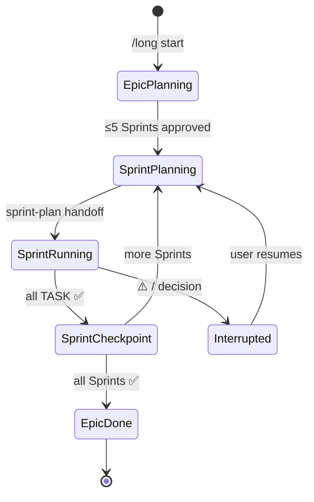

# long · hierarchy and convergence

Epic-level **three layers** for multi-Sprint work. No fourth task-ID layer. Aligns with **`sprint-plan`**「先总后分」; **long** owns the Epic shell across Sprints.

## Three layers

| Layer | ID shape | Carrier | Role | peer limit |
|-------|----------|---------|------|------------|
| **L0 Epic** | `EPIC-*` or title | `.dsh/growth/long-state.json` | total Goal · Done when · Sprint list | **≤5** Sprints |
| **L1 Sprint** | `SPRINT-*` | `.dsh/growth/plan.md` Active block | single-iteration Goal · TASK table | **≤5** TASKs |
| **L2 Task** | `TASK-*` | plan TASK table | verifiable increment · one commit | **≤5** (scale gate) |

Sprint Goal = **capability delivery**; tag/merge exits → **`release`** (v0.2+).

**Forbidden**:

- sub-TASK IDs inside a Task (steps stay inside Task; see **`run`**)
- TASK rows directly under Epic (must go through Sprint)
- new Theme mid-run → **next Sprint candidate**, not current table expansion

## MECE

| layer | mutually exclusive | collectively exhaustive |
|-------|-------------------|-------------------------|
| Sprint list | each Sprint has distinct Goal | covers Epic Done when P0 |
| TASK table | one verify command each | Sprint Done when provable by order |

Cannot fit ≤5 Sprints → raise abstraction or split Epics; do not add depth.

## Division of labor

| when | long | sprint-plan | run |
|------|------|-------------|-----|
| Epic → Sprint list | ✅ | | |
| single Sprint Goal/TASK/handoff | trigger | ✅ | |
| TASK impl + verify + commit | | | ✅ |
| Sprint archive | update long-state | archive notes | verify + archive |
| single-Sprint autonomous chain | does not replace | handoff | ✅ same session |

**long** does not bypass project verify · explicit user approval on handoff.

## Epic state machine

## Scope freeze

| event | action |
|-------|--------|
| new Theme during **run** | next Sprint candidate or long-state note |
| architecture conflict | `⚠️` · pause Epic · **`sprint-plan`** |
| user changes Epic Goal | new Epic or replan; no silent merge |

## References

- pacing → [pacing-checkpoint.md](pacing-checkpoint.md)
- single-Sprint autonomy → session continuation until decision (v0.3: `@dsh-super/workflow`)
- scale gate → **`sprint-plan`** · [docs/discipline.md](../../../docs/discipline.md)
